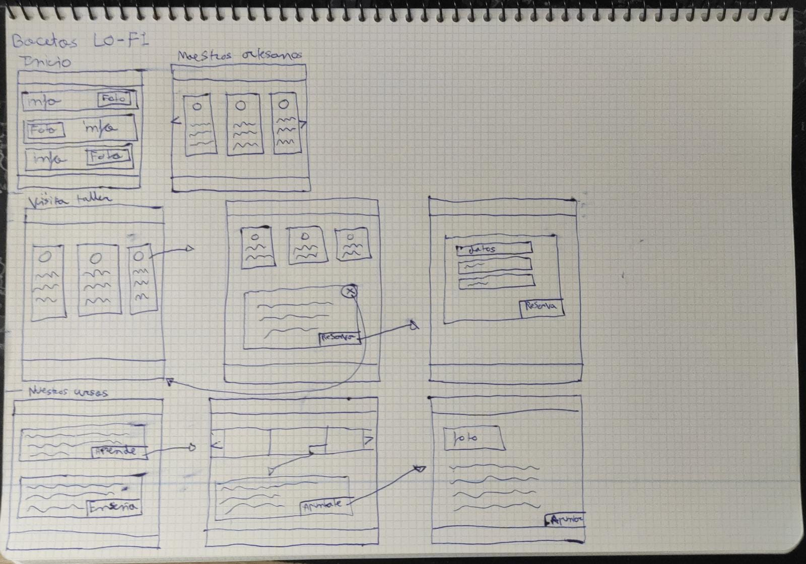

# DIU23  
Prácticas Diseño Interfaces de Usuario 2022-23 (Tema: Actividades de Turismo) 

>Grupo: DIU3_SoldadosDelNano.  Curso: 2022/23 

>Updated: 11/1/2023

>Proyecto: Artesanía Nazarí

>Descripción: Sitio web con actividades de visita y cursos relacionados con la artesanía nazarí 

 >Logotipo: 
  >
  >
  
>Miembros
 >* :bust_in_silhouette:   Jesús Jaenes Sánchez     :octocat: www.github.com/jesusk   
 >* :bust_in_silhouette:  Adrián Anguita Muñoz     :octocat: www.github.com/oneadri

----- 

# Proceso de Diseño 

## Paso 1. UX Desk Research & Analisis 

 1.a Competitive Analysis
-----

>Hemos elegido los diferentes sitios web anteriores ya que estamos en el contexto de reservar 
una experiencia turística.
- Artesanía Nazarí: Se centra en la cultura Nazarí, específicamente en visitas al taller de 
arte y la realización de otras actividades manuales. Ofrece distintas experiencias para 
grupos distintos (escuelas, erasmus).
- Tablao flamenco: Se trata de una experiencia visual junto a la gastronómica típica de 
Ganada. Permite además diferentes experiencias, como pueden ser rutas turísticas de 
sitios emblemáticos de Granada, clases de flamenco y demás actividades relacionadas.
- Tour guide: Ofrece tours gratuitos sobre los sitios más reconocidos en Granada, 
además de tener también tours guiados de pago.
>

 1.b Persona
---
>Alba:
Hemos elegido a esta persona ya que es una persona joven con la capacidad de intuir los 
diferentes interfaces y va a ser más exigente a la hora de hacer uso de ellos. Esta interesada 
vivir experiencias nuevas con sus amigas.

>Paco:
Hemos elegido a esta persona ya que se trata de una persona totalmente contraría a la hora de 
manejar las tecnologías, por lo que puede tener dificultades a la hora de hacer uso de ellas.
También esta interesado en hacer algunas actividades con los amigos.

-----

 1.c User Journey Map
---
>Hemos elegido estas experiencias similares porque son lo mas frecuentes y lo que más se 
adapta a la personalidad de estas dos personas. También para ver como se comporta una 
persona acostumbrada al uso de estos sitios webs frente a una persona que no está habituada.

>Journey map de Alba

>Journey map de Paco

----

 1.d Usability Review
----
>Enlace al documento: [Usability Review](https://github.com/SoldadosDelNano/DIU/blob/master/P1/Usability-review.xlsx)

>Valoración final (numérica): 54

>Comentario sobre la valoración: Corresponde totalmente, esta página tiene mucho que mejorar, tanto a nivel de usabilidad como a nivel funcional.

## Paso 2. UX Design  

 2.a Feedback Capture Grid / EMpathy map / POV
----

> En nuestro caso hemos elegido hacer una malla receptora de ideas.
>
    
>Nuestra propuesta de valor será la de aplicar cursos para aprender a distintos niveles y que
también alguien profesional pueda indicar que desea impartir algunos de estos cursos,
eligiendo también el nivel deseado.
Somos conscientes que podemos agrandar tanto como queramos los cursos en sí en cuanto a
contextos, diferentes usuarios, por grupos, individuales... Pero hemos optado por hacer
nuestra propuesta de valor más genérica.

 2.b ScopeCanvas
----
>

 2.b Tasks analysis 
-----

>>> Definir "User Map" y "Task Flow" ... 
>>

 2.c IA: Sitemap + Labelling 
----
> Identificar términos para diálogo con usuario  
>
>

 2.d Wireframes
-----

>Hemos diseñado unos bocetos de forma muy general para ver como vamos a plantera nuestro diseño 
>

## Paso 3. Mi UX-Case Study (diseño)

 3.a Moodboard
-----

>
> Nuestro logotipo ha sido diseñado con la ayuda de https://logomakr.com/ además para el diseño de nuestro moodboard hemos utilizado https://app.milanote.com/
> Este sería nuestro logotipo principal:
>

  3.b Landing Page
----

>Para hacer nuestra landing page hemos usado la herramienta https://webflow.com/
>

 3.c Guidelines
----
>Para abordar esta parte hemos investigado sobre los diferentes patrones y guidelines que existen apoyándonos en páginas como: https://developer.apple.com/design/human-interface-guidelines/ https://m3.material.io/ 
>•	Para el caso de los botones hemos optado por un botón rectangular cuadrado sencillo sin bordes.
> 
>•	Para ilustrar las diferentes opciones de los cursos hemos utilizado las llamadas cards que contendrán una foto junto a una descripción breve y un botón.
> 
>•	Para los iconos hemos elegido un estilo redondeado con un relleno sólido y nítido.
> 
>•	Para los estilos de tipografía hemos optado por dos tipos. Una para los menús y títulos(headers) y otra para el texto contenido.
>
 
Por último, para nuestro layout en general hemos optado por bloques que contendrá las ya nombradas cards o información de otro tipo de forma breve de forma que el usuario vea la información de forma clara y concisa.

  3.d Mockup
----
>Para diseñar las demás interfaces hemos optado por usar la herramienta de webflow al igual que hicimos con la landing page. Vamos a mostrar las interfaces de:
>•	visita al taller
>•	cursos=>aprende
>•	cursos=>enseña
>•	reserva(cursos)
>
>
>
>

 3.e ¿My UX-Case Study?
-----
>Hemos actualizado nuestro UX-Case Study hasta el punto 3.
>https://github.com/SoldadosDelNano/DIU#readme

## Paso 4. Evaluación 

 4.a Caso asignado
----

>>> Breve descripción del caso asignado con enlace a  su repositorio Github

 4.b User Testing
----

>>> Seleccione 4 personas ficticias. Exprese las ideas de posibles situaciones conflictivas de esa persona en las propuestas evaluadas. Asigne dos a Caso A y 2 al caso B
 

| Usuarios | Sexo/Edad     | Ocupación   |  Exp.TIC    | Personalidad | Plataforma | TestA/B
| ------------- | -------- | ----------- | ----------- | -----------  | ---------- | ----
| User1's name  | H / 18   | Estudiante  | Media       | Introvertido | Web.       | A 
| User2's name  | H / 18   | Estudiante  | Media       | Timido       | Web        | A 
| User3's name  | M / 35   | Abogado     | Baja        | Emocional    | móvil      | B 
| User4's name  | H / 18   | Estudiante  | Media       | Racional     | Web        | B 

. 4.c Cuestionario SUS
----

>>> Usaremos el **Cuestionario SUS** para valorar la satisfacción de cada usuario con el diseño (A/B) realizado. Para ello usamos la [hoja de cálculo](https://github.com/mgea/DIU19/blob/master/Cuestionario%20SUS%20DIU.xlsx) para calcular resultados sigiendo las pautas para usar la escala SUS e interpretar los resultados
http://usabilitygeek.com/how-to-use-the-system-usability-scale-sus-to-evaluate-the-usability-of-your-website/)
Para más información, consultar aquí sobre la [metodología SUS](https://cui.unige.ch/isi/icle-wiki/_media/ipm:test-suschapt.pdf)

>>> Adjuntar captura de imagen con los resultados + Valoración personal 

 4.d Usability Report
----

>> Añadir report de usabilidad para práctica B (la de los compañeros)

>>> Valoración personal 

>>> ## Paso 5. Evaluación de Accesibilidad  (no necesaria)

>>>   5.a Accesibility evaluation Report 
>>>> ----

>>> Indica qué pretendes evaluar (de accesibilidad) sobre qué APP y qué resultados has obtenido 

>>> 5.a) Evaluación de la Accesibilidad (con simuladores o verificación de WACG) 
>>> 5.b) Uso de simuladores de accesibilidad 

>>> (uso de tabla de datos, indicar herramientas usadas) 

>>> 5.c Breve resumen del estudio de accesibilidad (de práctica 1) y puntos fuertes y de mejora de los criterios de accesibilidad de tu diseño propuesto en Práctica 4.

## Conclusión final / Valoración de las prácticas

>>> (90-150 palabras) Opinión del proceso de desarrollo de diseño siguiendo metodología UX y valoración (positiva /negativa) de los resultados obtenidos  

